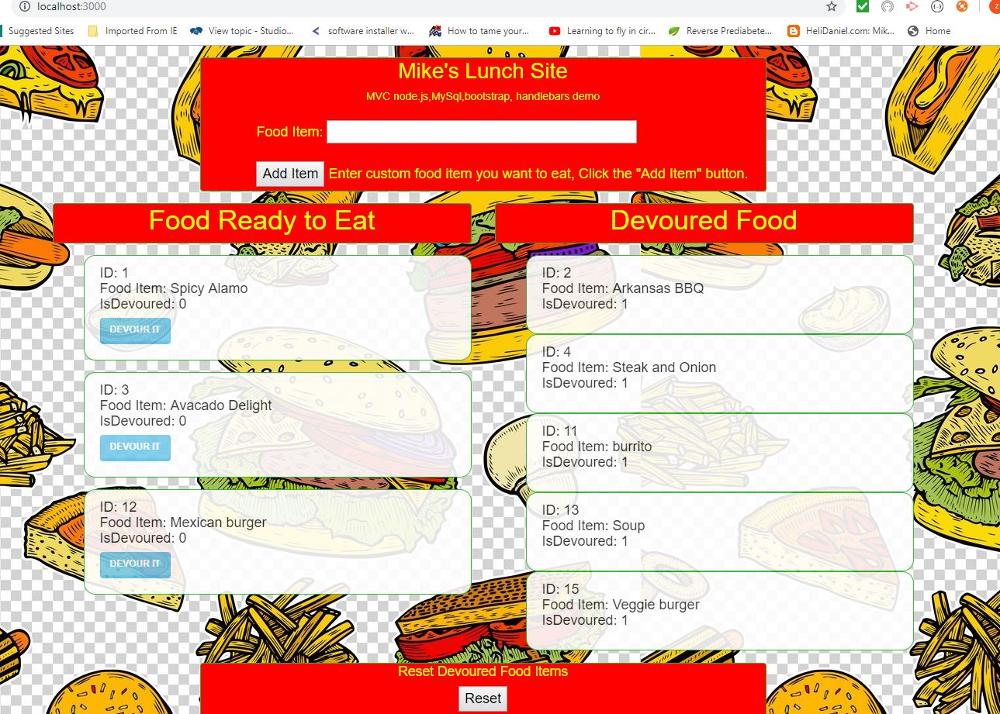
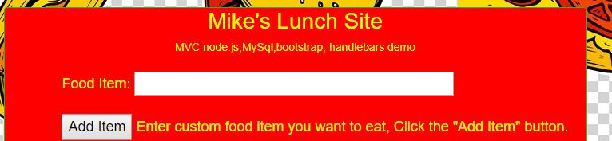

# burger
Node js application using Mysql and MVC design

**Burger** is a web browser application using **node.js**, **MySql** database,**Handlebars** template engine.  This application is based on **MVC** design concept of *Model* , *View*, and *Controller* layers. 

There is a one-page html page rendered using  *Bootstrap* library . The database in *MySql  is called *burgers_db* with one table called *burgers* containing three columns *index*, *burger_name*, *devoured* which is a *boolean* data type. 
 
When the web page is first rendered, all the  records in the burgers table are presented to the html page with a *sql select all call* using the **GET** api call. We are using **Handlebars** engine to render each record. The records are filtered by **Handlebars** based the boolean field , *devoured*. If  *devoured* is false, the record appears on the left column using *Bootstrap* card along with a button. 
If *devoured* is true, then the records is rendered on the right column. 

The demo concept here is user can choose to "devour" a food item record on the left "*Food Ready to Eat*"  because it is available. The user would click on the *devoured* button for that record. Clicking on *devoured* button triggers a *put* transaction to the server by updating the boolean field *devoured* with a **PUT** api call to the server. The response back from the server is to render all the records again. This time the just "devoured" record appears on the right column under "*Devoured Food*". 

The **create** record transaction is demonstated when the user enters a new food item name in a form at the top of the page. This is calling the **POST** api call to the server.   
The newly created record will appear on the right column ("Food Ready to Eat"). 

I included reset button at the bottom of the page which makes a  **PUT** call  to update the boolean value back to *false* for the *devoured* field. All the records that are on the right column are updated and will render to the left column. 

My future plans for this web site application  is to include a *Delete* button for each food item that way I represent all 4 api call types,  **POST, PUT, GET, DELETE**. I also may plan to add additional fields to the burgers table in addition to just *burger_name* . Perhaps, *calories*, *meat type*, *cheese type* etc.

